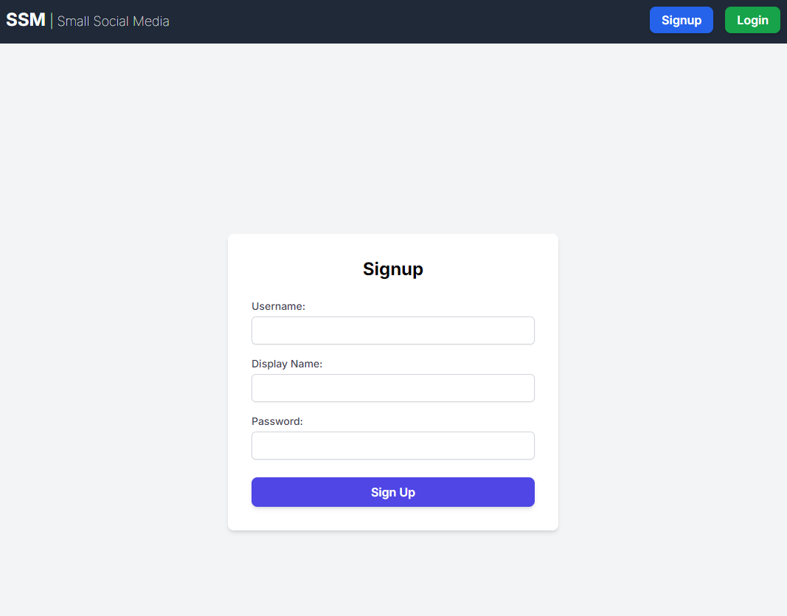
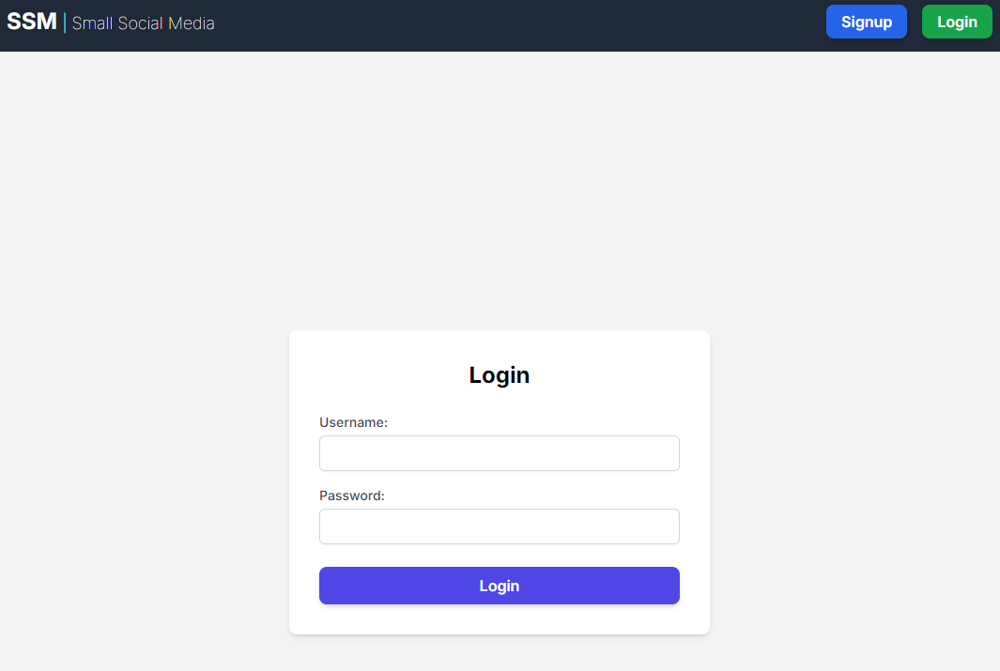
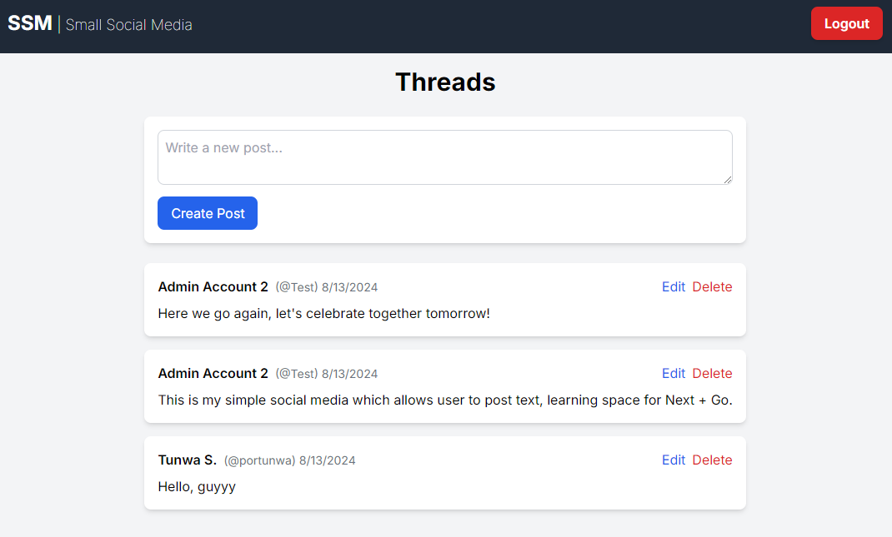
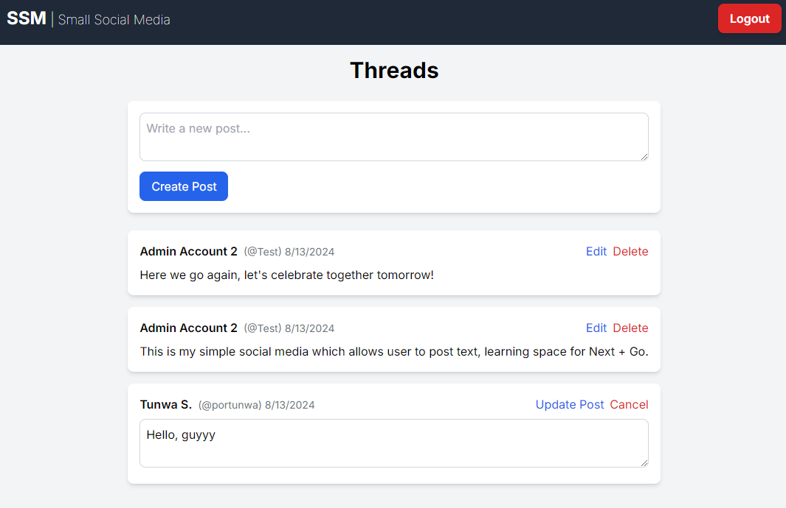

# User Guide for social media app

## Pages

### Sign Up
```
localhost:3000/signup
```

- **Description**: This page allows users to sign up for the app.
- **Fields**:
  - **Username**: The username of the user.
  - **Password**: The password of the user.
  - **Display Name**: The display name of user on platform.



### Log In
```
localhost:3000/login
```


- **Description**: This page allows users to log in to the app.
- **Fields**:
  - **Username**: The username of the user.
  - **Password**: The password of the user.



### Home / Feed
```
localhost:3000/feed
```

- **Description**: This page displays the posts from user and allow user to create, edit, delete posts.


